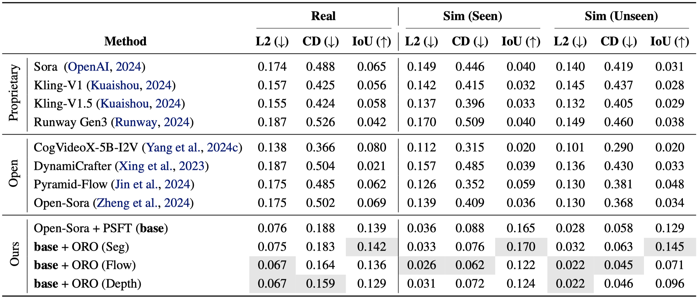

<div align="center" style="font-family: charter;">
<h1>&nbsp;<i>Pisa Experiments</i>:</br>Exploring Physics Post-Training for Video Diffusion Models by Watching Stuff Drop</h1>

<!-- 
<br /> -->

<a href="https://arxiv.org/pdf/2503.09595" target="_blank">
    </a>
<a href="https://vision-x-nyu.github.io/pisa-experiments.github.io" target="_blank">
    </a>
<a href="https://huggingface.co/datasets/nyu-visionx/pisa-experiments" target="_blank">
    </a>

<div>
    <a href="https://lichenyu20.github.io/" target="_blank">Chenyu Li</a><sup>1*</sup>,</span>
    <a href="https://ojmichel.github.io/" target="_blank">Oscar Michel</a><sup>1*</sup>, </span>
    <a href="https://xichenpan.com/" target="_blank">Xichen Pan</a><sup>1</sup>,</span>
    <a href="https://www.linkedin.cn/incareer/in/sainan-stephanie-liu" target="_blank">Sainan Liu</a><sup>2</sup>,</span>
    <a href="https://mikeroberts3000.github.io/" target="_blank">Mike Roberts</a><sup>2</sup>,</span>
    <a href="https://www.sainingxie.com/" target="_blank">Saining Xie</a><sup>1</sup></span>
</div>

<div>
    <sup>1</sup>New York University&emsp;
    <sup>2</sup>Intel Labs&emsp;
</div>


<p align="justify"><i>Our PISA (<b>P</b>hysics-<b>I</b>nformed <b>S</b>imulation and <b>A</b>lignment) evaluation framework includes a new video dataset, where objects are dropped in a variety of real-world (<b>Left</b>) and synthetic (<b>Right</b>) scenes. For visualization purposes, we depict object motion by overlaying multiple video frames in each image shown above. Our real-world videos enable us to evaluate the physical accuracy of generated video output, and our synthetic videos enable us to improve accuracy through the use of post-training alignment methods.</i></p>

</div>      

## Release
- `2025-3-12` :rocket: We released our [PisaBench](https://huggingface.co/datasets/nyu-visionx/pisa-experiments/tree/main/pisabench), [training data](https://huggingface.co/datasets/nyu-visionx/pisa-experiments/tree/main/training_data), [model checkpoints](https://huggingface.co/datasets/nyu-visionx/pisa-experiments/tree/main/checkpoints), and code.

## Contents
- [Installation](#installation)
- [PisaBench](#pisabench)
- [Data Simulation](#data-simulation)
- [Post-Training](#Post-Training)
- [Acknowledgements](#acknowledgements)
- [Citation](#citation)
- [Contact](#contact)

## Installation

Clone the repository and submodules: 
```bash
git clone git@github.com:vision-x-nyu/pisa-experiments.git
cd pisa-experiments
git submodule update --init --recursive
```
Create conda environment: 

```bash
conda create --name pisa python=3.10
conda activate pisa
```
### Evaluation

To run evaluation, please install [SAM 2](https://github.com/facebookresearch/sam2) dependencies. Installation details can be found at: [SAM 2](https://github.com/facebookresearch/sam2).

### Simulation

We have created a conda envionrment that is able to support Kubric. However, Kubric recommends using a Docker container, as some users have reported difficulties when directly intalling the dependencies into an environment. If you are having trouble you may want to try Docker, and the instructions can be found [here](https://github.com/google-research/kubric?tab=readme-ov-file#getting-started). 

For conda, please run:

```bash
pip install -r sim_data/requirements.txt
```

### Post-Training

Our post-training code is based on [Open-Sora](https://github.com/hpcaitech/Open-Sora), [Depth-Anything-V2](https://github.com/DepthAnything/Depth-Anything-V2), [SAM 2](https://github.com/facebookresearch/sam2), and [RAFT](https://github.com/princeton-vl/RAFT). To install [Open-Sora](https://github.com/hpcaitech/Open-Sora) dependencies:

```bash
pip install -r requirements/requirements-cu121.txt
pip install -v -e .

# Optional, recommended for fast speed, especially for training
# install flash attention
# set enable_flash_attn=False in config to disable flash attention
pip install packaging ninja
pip install flash-attn --no-build-isolation

# install apex
# set enable_layernorm_kernel=False in config to disable apex
pip install -v --disable-pip-version-check --no-cache-dir --no-build-isolation --config-settings "--build-option=--cpp_ext" --config-settings "--build-option=--cuda_ext" git+https://github.com/NVIDIA/apex.git
```

Installation details for [Depth-Anything-V2](https://github.com/DepthAnything/Depth-Anything-V2), [SAM 2](https://github.com/facebookresearch/sam2), [RAFT](https://github.com/princeton-vl/RAFT) can be found at:

* [Depth-Anything-V2](https://github.com/DepthAnything/Depth-Anything-V2)
* [SAM 2](https://github.com/facebookresearch/sam2)
* [RAFT](https://github.com/princeton-vl/RAFT)

## PisaBench

### Real World Videos

We curate a dataset comprising 361 videos demonstrating the dropping task.Each video begins with an object suspended by an invisible wire in the first frame. We cut the video clips to begin as soon as the wire is released and record the videos in slow-motion at 120 frames per second (fps) with cellphone cameras mounted on tripods to eliminate camera motion.

We save each video in the following fomat:

```
├── 00000.jpg
├── 00001.jpg
...
├── movie.mp4
└── clip_info.json
```

* `clip_info.json` is a json file that contains positive/negative point annotations and text descriptions for each video.

Real world videos can be found at: `pisabench/real.zip`.

### Simulated Test Videos

Since our post-training process uses a dataset of simulated videos, we also create a simulation test-set of 60 videos for understanding sim2real transfer. We create two splits of 30 videos each: one featuring objects and backgrounds seen during training, and the other featuring unseen objects and backgrounds.

We save each video in the following format:

```bash
├── rbga_00000.jpg
├── rbga_00001.jpg
...
├── movie.gif
├── mask.npz
├── clip_info.json
```

- `mask.npz` is segmentation masks for all objects with shape `[V, N, H, W]`, where `V` is the number of video frames, `N` is the number of objects, `H` is the height, and `W` is the `width`.
- `clip_info.json` is a json file that contains annotations and text descriptions for each video.

Simulated test videos can be found at: `pisabench/sim.zip`.

### Evaluation

When evaluating a new model, please convert our videos at the corresponding resolution. Our evaluation framework currently supports 1:1 aspect ratio. We provide example scripts to convert the resolution:
```bash
# Real world videos.
bash scripts/data_processing/convert_real.sh

# Simulated test videos.
bash scripts/data_processing/convert_sim.sh
```
Metrics calculations require segmentation masks, and we provide scripts to generate segmentation masks using SAM 2: 
```bash
# Download SAM 2 checkpoint.
cd models && bash download_sam2.sh && cd ..

# Generate masks.
bash scripts/data_processing/generate_mask.sh
```
After generating masks, you can run the evaluation. We provide an example script to run the evaluation:
```bash
# Real world videos.
bash scripts/evaluation/eval_real.sh

# Simulated test videos.
bash scripts/evaluation/eval_sim.sh
```
The example config files are in `configs`. You can modify the config files to run the evaluation on your model.

### Evaluation Results
We evaluate 4 open models including CogVideoX-5B-I2V, DynamiCrafter, Pyramid-Flow, and Open-Sora-V1.2, as well as 4 closed models including Sora, Kling-V1, Kling-V1.5, and Runway Gen3. We also evaluate OpenSora post-trained through the processes of Supervised Fine-Tuning (PSFT) and Object Reward Optimization (ORO).



## Data Simulation

We use Google's [Kubric](https://github.com/google-research/kubric) for generating simulated physics videos. Kubric combines [PyBullet](https://pybullet.org/wordpress/) and [Blender](https://www.blender.org/) for handling simulation and rendering seamlessly in a unified library.

We use the [Google Scanned Objects](https://research.google/blog/scanned-objects-by-google-research-a-dataset-of-3d-scanned-common-household-items/) (GSO) dataset which is already supported in Kubric. The GSO dataset consists of ~1000 high quality 3D objects that come from scans of a variety of everyday objects.

For generating a single video, please run:

```bash
bash sim_data/generate_single_sample.sh
```

If you would like to generate many examples in parallel, you can run:

```bash
bash sim_data/generate_parallel.sh
```

## Post-Training

Our approach for post-training is inspired by the two-stage pipeline consisting of supervised fine-tuning followed by reward modeling commonly used in LLMs. We provide an example script to run the inference:

```bash
bash scripts/inference/inference.sh
```

### Stage 1: Physics Supervised Fine-Tuning (PSFT)

We fine-tune [Open-Sora](https://github.com/hpcaitech/Open-Sora) in simulated videos. We provide an example script to run PSFT:

```bash
bash scripts/post_training/base.sh
```

### Stage 2: Object Reward Optimization (ORO)

We propose Segmentation Reward, Optical Flow Reward, and Depth Reward and implement them in [VADER](https://github.com/mihirp1998/VADER) framework. We provide example scripts to run ORO: 

```bash
# Download SAM 2 and Depth-Anything-V2 checkpoints.
cd models && bash download_sam2.sh && bash download_depth_anything.sh && cd ..

# ORO(Seg)
bash scripts/post_training/oro_seg.sh

# ORO(Flow)
bash scripts/post_training/oro_flow.sh

# ORO(Depth)
bash scripts/post_training/oro_depth.sh
```

## Acknowledgements
We appreciate the following GitHub repos a lot for their valuable code and efforts: 

* Open-Sora (https://github.com/hpcaitech/Open-Sora)
* VADER (https://github.com/mihirp1998/VADER)

* SAM 2 (https://github.com/facebookresearch/sam2)
* Depth-Anything-V2 (https://github.com/DepthAnything/Depth-Anything-V2)
* RAFT (https://github.com/princeton-vl/RAFT)

## Citation
If you find our paper and code useful in your research, please consider giving us a star ⭐ and citing our work 📝.
```

```
## Contact
If you have any questions or suggestions, please feel free to contact: 
* lichenyuthu@gmail.com
* micheloscar20@gmail.com